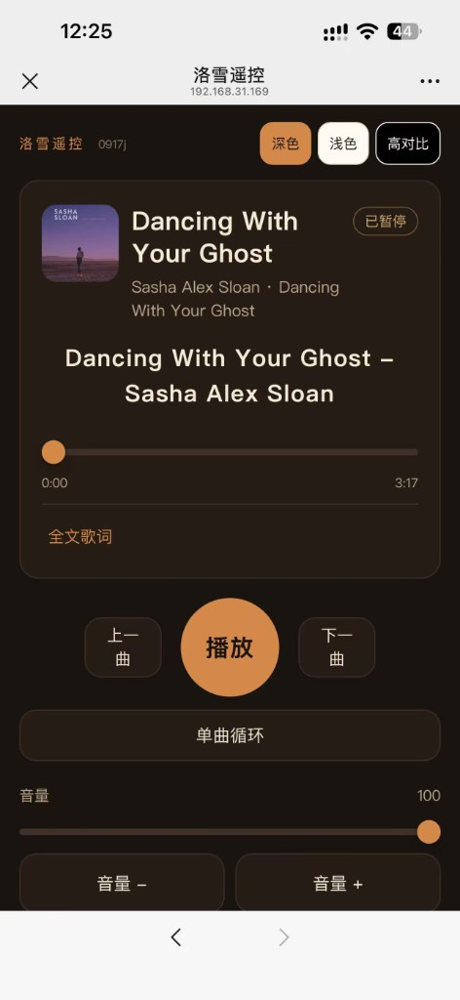
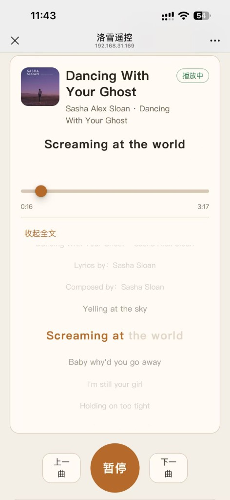
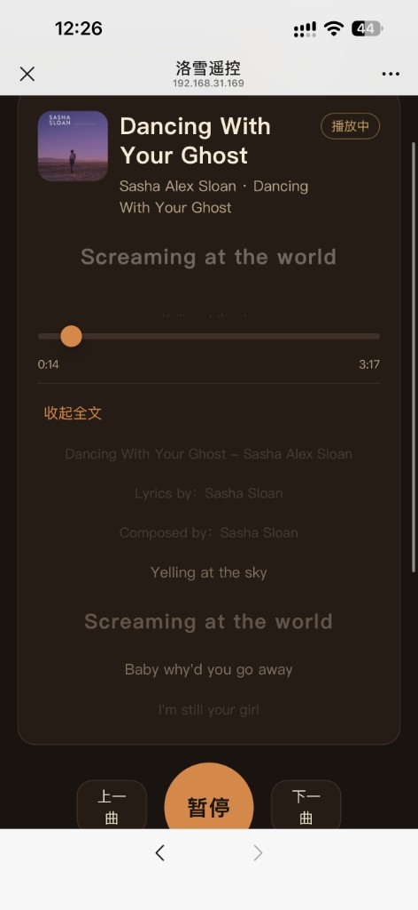
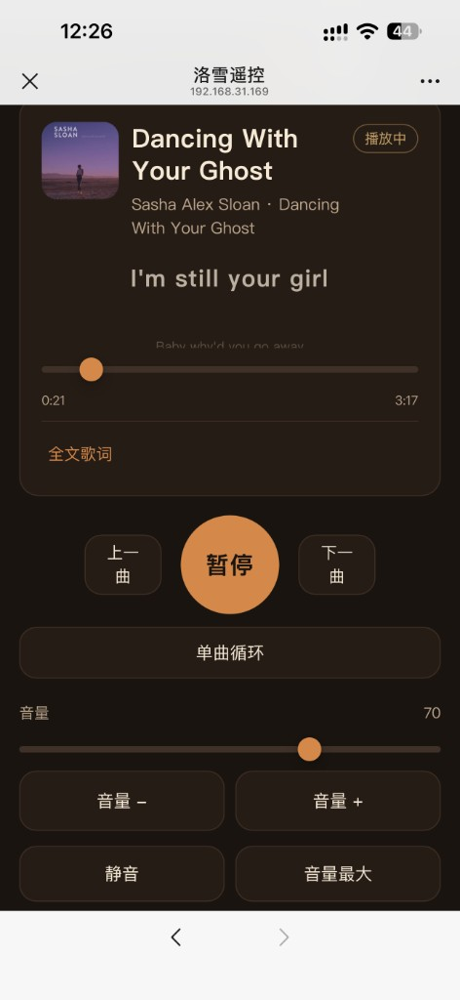
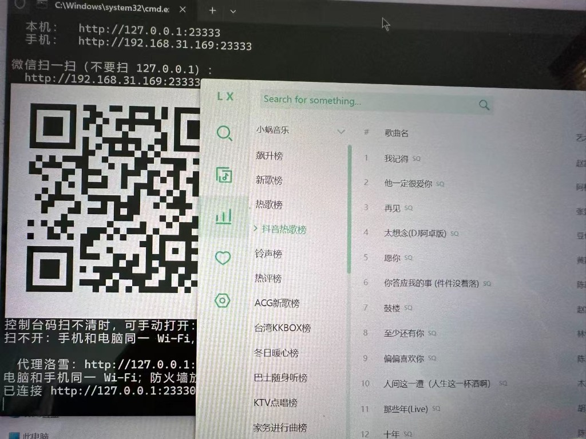

# LX Music Open API Controller

**语言 / Language:** [中文](README.md) | English

## 🚀 Recommended: [ofox.ai](https://ofox.io/x/aiv123)

> **In short**: One account for GPT-5.5 / Claude 4.8 Opus / Gemini 3.5 Flash and **100+** top models. First top-up gets an extra **$3** credit.

[👉 Sign up](https://ofox.io/x/aiv123) · Global dedicated lines · Enterprise SLA · No conversation retention

| ⚡️ Fast & Stable | 🧠 Full Model Coverage | 🛡️ Privacy |
|:---:|:---:|:---:|
| Global dedicated lines, enterprise SLA | 100+ models, one account | No conversation retention |

## ☕ Buy Me a Coke

Open source takes effort — sponsorship is welcome:  
👉 [爱发电 / Afdian](https://ifdian.net/a/shellsec)

---

A small Python tool that talks to the LX Music desktop Open API: skip tracks, play/pause, show the current song, volume/mute/seek, and collect. The computer can also host a web page so a phone can remote-control playback. Playback control uses the **Python 3 standard library**; WeChat QR codes need `segno` (see `requirements.txt`; `lx启动.bat` / `lx启动.sh` will try to install it). The page and proxy both live in `lx_control.py`.

<p align="center">
  
  
  
  
</p>
<p align="center"><sub>Phone web remote: dark / light / high-contrast, with progress, lyrics, volume, and skip.</sub></p>

## Use cases

### Scan the QR code in WeChat to control LX Music on the PC

LX Music is playing on the computer. Phone and PC are on the **same Wi-Fi**. Double-click `lx启动.bat` (or `./lx启动.sh` on macOS / Linux). The console prints the LAN URL and draws a **black-on-white** QR code. Open WeChat **Scan**, point at that code — no extra app, no typing an IP — and skip, pause, change volume, or read lyrics from the phone.

<p align="center">
  
</p>

- Scan `http://192.168.x.x:23333`. **Do not** scan `127.0.0.1` (that URL is only for the PC itself).
- If the console font smears the code, open `remote-qr.png` in the same folder and scan that.
- If the phone cannot open it: same Wi-Fi, and allow **TCP 23333** through the firewall.

You can also use the CLI REPL on the same computer; Windows supports `--keys` for single-key control. Full steps are in **Phone web remote** below.

> **Local `--web` / `lx启动.bat` can turn Open API on automatically.** Official LX Music has no CLI flag for this. When the script auto-launches the desktop app locally (and it is not already running), it writes `openAPI.enable` to `true` first. If LX Music is already running, restart it or enable Open API by hand. See **Enable the API in LX Music** below.

Official docs: <https://lyswhut.github.io/lx-music-doc/desktop/open-api> (**v2.7.0+**; older desktop builds are not guaranteed.)

## Enable the API in LX Music

Official LX Music has **no** CLI flag to enable Open API. With local `--web` / `lx启动.bat`, if the Open API is not up yet **and** LX Music is **not** already running, the script writes the desktop config before auto-launch:

- Sets `setting["openAPI.enable"]` to `true`
- Config file: portable install uses `install-dir/portable/userData/LxDatas/config_v2.json`; otherwise `%APPDATA%\lx-music-desktop\LxDatas\config_v2.json` (macOS: `~/Library/Application Support/lx-music-desktop/LxDatas/config_v2.json`; Linux: `~/.config/lx-music-desktop/LxDatas/config_v2.json`)
- Keeps an existing port; defaults to `23330` if missing
- Does **not** auto-enable **Allow access from LAN** (`bindLan`). Local web remote usually does not need it; tick it yourself for another machine

If LX Music is **already running**, that config write will not take effect until you restart the desktop app, or enable it by hand in settings as below. To skip auto-launch: `--no-launch`.

To enable it yourself:

1. Open **LX Music Desktop** (**v2.7.0** or later).
2. **Settings → Open API**.
3. Enable **Open API service**.
4. Keep the **service port** at `23330` (or match it with `--port` / `LX_API_PORT` when starting this script).
5. To control from **another machine / a LAN IP**, enable **Allow access from LAN**.  
   If this is off, the service binds `127.0.0.1` only, and `192.168.x.x` will fail.
6. The settings page lists loopback and LAN addresses under **Service address** — use one of those.

The official Open API has **no password / token**.  
HTTP 401 Forbidden in the source is the default response for an unknown path, not a missing key. `--token` or `LX_API_TOKEN` is only needed if you put your own reverse proxy/gateway in front.

CORS: the service already returns `Access-Control-Allow-Origin: *`. Browser pages can call it cross-origin; this script is local Python, so CORS does not apply.

Protocol: **HTTP GET only**. Live status uses **SSE** (`/subscribe-player-status`); there is **no WebSocket**. This script uses short requests for skip/control and does not connect to SSE.

## Phone web remote (recommended)

Phone and computer must be on the **same Wi-Fi / LAN**. The matching **LX Music desktop** app must be installed. A local `--web` auto-launch can write the Open API switch (see **Enable the API in LX Music**); you can also tick it yourself under **Settings → Open API**.

With `--web` / `lx启动.bat`, if the Open API is not up yet, the script tries to launch LX Music desktop (it will not start a second copy if one is already running) and waits up to about 40 seconds. Before a local auto-launch it writes the Open API switch (see **Enable the API in LX Music**). You can keep the script in the install folder or a subfolder (for example `D:\Program Files\lx-music-desktop\lxpy`); it walks parent directories to find `lx-music-desktop.exe`. If the install path cannot be found, set `LX_APP`, `--lx-exe`, or `"lxExe"` in `lx_remote_state.json`. To skip auto-launch: `--no-launch`. The CLI REPL / `--keys` modes do not auto-start LX Music.

| OS | How to start |
| --- | --- |
| Windows | Double-click `lx启动.bat` |
| macOS / Linux | `chmod +x lx启动.sh` (once), then `./lx启动.sh` |

Or on any OS:

```bash
python3 lx_control.py --web
```

The server listens on `0.0.0.0:23333`. The console prints **local** and **phone** URLs and draws a **black-on-white** LAN QR code (`http://192.168.x.x:23333`, not 127.0.0.1). Scan it with **WeChat Scan**. If the console font smears the code, open `remote-qr.png` in the same folder (it does not pop up automatically). If scanning fails: same Wi-Fi, and allow **TCP 23333** through the firewall.

The page only talks to 23333. The computer running this script proxies to the LX Open API, so the phone does not need to reach 23330.

- **LX Music and this script on the same computer** (`--web` / `lx启动.bat` / `lx启动.sh` when no host is set): proxy `127.0.0.1:23330`. You do not need “Allow access from LAN”. If the local API only works on loopback, the script switches to `127.0.0.1` automatically.
- **LX Music on another computer**: set `LX_API_HOST` / `--host` to that machine’s IP and enable **Allow access from LAN**. Auto-launch does **not** run when the target is not local.

```bash
# LX Music on this machine
python3 lx_control.py --web --host 127.0.0.1

# LX Music on another LAN machine
LX_API_HOST=192.168.31.169 python3 lx_control.py --web
```

The top-right **Dark / Light / High contrast** switch is remembered in the phone browser. The track area shows the current lyric line (plus a translation/romaji line when present). **Full lyrics** expands the LRC; tapping a line seeks to that time. The remote page only controls the current track — no search, playlists, or charts.

Also required:

1. **Python 3** (`python3` or `python` / Windows `py -3`). The first QR render needs `pip install -r requirements.txt` (the start scripts try this).
2. Firewall allow **TCP 23333** (Windows may prompt; macOS “System Settings → Network / Firewall”; Linux depends on the distro). LX Music’s own 23330 must be reachable from the machine running this script.
3. Avoid cellular / guest Wi-Fi client isolation, or the phone cannot reach the computer. WeChat must scan the LAN URL, not 127.0.0.1.

Web port: `--web-port 23333` or `LX_WEB_PORT`.

CLI REPL: `python3 lx_control.py` (do not add `--web`). `--keys` single-key hotkeys are Windows-only; other OS fall back to a normal REPL.

## Command-line usage

In this directory:

```bash
python lx_control.py
```

If unspecified, it defaults to `http://192.168.31.169:23330` (use `--host 127.0.0.1` for local LX Music). On start it reads `/status` once, then enters a REPL:

```
> n          # next track
> p          # previous track
> play       # play
> pause      # pause
> t          # toggle play/pause from current state
> s          # current track (includes volume)
> vol        # current volume / mute
> vol 50     # set volume to 50 (0-100)
> vol +10    # relative +10
> mute       # mute
> unmute     # unmute
> seek 30    # jump to 30 seconds
> seek 1:20  # jump to 1 minute 20 seconds
> collect    # collect current track
> lyric      # current LRC
> lyric-all  # full lyrics JSON
> help
> quit
```

One-shot commands (no REPL):

```bash
python lx_control.py next
python lx_control.py status
python lx_control.py volume
python lx_control.py volume 50
python lx_control.py mute
python lx_control.py unmute
python lx_control.py seek 30
```

## Volume

Official API: `GET /volume?volume=0-100` (docs say 1-100; the source allows 0). Current volume is not in the default `/status`; the script requests `filter=...volume,mute,collect`.

```bash
python lx_control.py volume          # read only
python lx_control.py volume 80       # set to 80
python lx_control.py volume +10      # +10 from current
python lx_control.py mute            # GET /mute?mute=true
python lx_control.py unmute          # GET /mute?mute=false
```

Same in the REPL: `vol`, `vol 50`, `mute` / `unmute`. `status` also includes fields like “volume 100”.

The official API has **no** play-mode (loop/shuffle) or playlist endpoints. Those stay in the LX Music window.

Override the address:

```bash
python lx_control.py --host 127.0.0.1 --port 23330 status
python lx_control.py --url http://192.168.31.169:23330 next
```

Environment variables (CLI flags win):

| Variable | Meaning |
| --- | --- |
| `LX_API_HOST` | Open API host. CLI default `192.168.31.169`; `--web` / `lx启动.bat` / `lx启动.sh` default `127.0.0.1` when unset |
| `LX_API_PORT` | Port, default `23330` |
| `LX_API_URL` | Full base URL; overrides host/port when set |
| `LX_API_TOKEN` | Optional. Official API does not need it |
| `LX_WEB_PORT` | Web port, default `23333` |
| `LX_WEB_BIND` | Web bind address, default `0.0.0.0` |
| `LX_APP` / `LX_EXE` | Path to the desktop exe / `.app` when install dir cannot be found |
| `LX_APP_WAIT` | Seconds to wait for Open API after auto-launch, default 40 |

Windows single-key skip (no Enter):

```bash
python lx_control.py --keys
```

`n` next, `p` previous, space play/pause, `s` current track, `q` quit.

## API paths used by this script

Official control endpoints are all **GET**, not `play-next` / `play-prev`.

| Action | Path | Script command |
| --- | --- | --- |
| Current track/status | `GET /status` | `status` |
| Next | `GET /skip-next` | `next` |
| Previous | `GET /skip-prev` | `prev` |
| Play / pause | `GET /play`, `GET /pause` | `play` / `pause` / `toggle` |
| Current LRC | `GET /lyric` | `lyric` |
| All lyrics | `GET /lyric-all` | `lyric-all` |
| Volume | `GET /volume?volume=0-100` | `volume` / `volume 50` |
| Mute | `GET /mute?mute=true\|false` | `mute` / `unmute` |
| Seek | `GET /seek?offset=seconds` | `seek 30` |
| Collect / uncollect | `GET /collect`, `GET /uncollect` | `collect` / `uncollect` |
| Live status (SSE) | `GET /subscribe-player-status` | not used |

In the REPL, `next` / `play-next` both hit `/skip-next`. There are no official play-mode or playlist-list endpoints.

## Common errors

| Symptom | Cause / fix |
| --- | --- |
| Phone cannot open the page | Computer is not running `--web`, not the same Wi-Fi, or firewall blocks **23333** |
| WeChat scan fails | Scan `http://PC-LAN-IP:23333`; try `remote-qr.png`; check firewall 23333 |
| Page opens but cannot reach LX Music | LX Music is off, wrong port, or the script is not pointing at that machine (use `127.0.0.1` locally; enable “Allow access from LAN” across devices) |
| Desktop app not found | Install LX Music and retry, or set `LX_APP` / `--lx-exe` to `lx-music-desktop.exe` |
| Process running but API unreachable | Cannot hot-enable while running: tick **Settings → Open API → enable**, or quit LX Music and let `--web` / `lx启动.bat` write the config before launch |
| Connection refused / timeout | LX Music off, LAN access not allowed, wrong IP/port, or firewall blocks 23330 |
| Only `127.0.0.1` works, LAN IP fails | “Allow access from LAN” is off (otherwise it listens on 127.0.0.1 only) |
| HTTP 401 Forbidden | Wrong path (e.g. `/play-next`). Official API has no key; only a custom gateway checks a token |
| HTTP 400 | Invalid `seek` / `volume` / `mute` parameter |
| Connected but skip does nothing | API is up, but there is no next/previous track in the player |
| Browser CORS failure | Older builds before CORS; upgrade, or use this script to bypass the browser |

If `python` is missing on Windows, use `py -3 lx_control.py`. macOS / Linux usually use `python3`.
